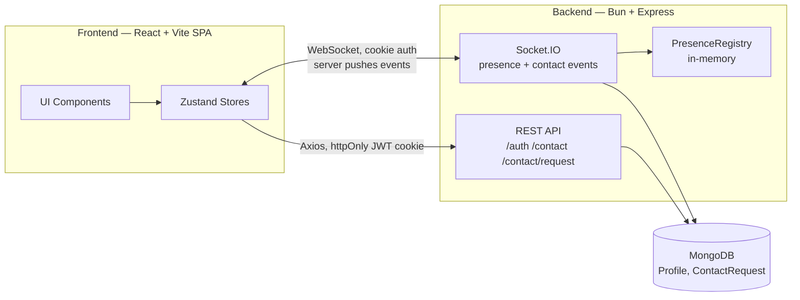
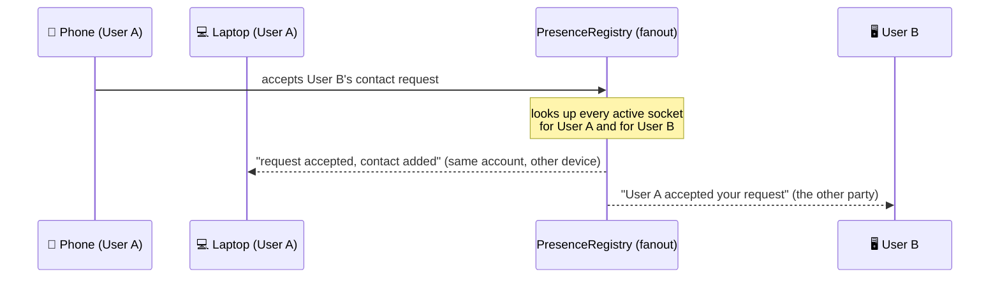

# Blackjack for Friends

Multiplayer blackjack played in real-time. Players add contacts, send invites, and join game lobbies.

**What's here today is fully functional** — auth and contacts/presence run end-to-end. Clone the repo and try it yourself: `bun run tester` boots a local demo in seconds, no database setup required (see [Demo / Local Testing](#demo--local-testing)).

## Features

- Sign up, sign in, sign out — sessions persist across visits
- Add contacts by username; sending, accepting, rejecting, and cancelling requests all sync in real time
- See which of your contacts are online, live
- Every real-time update reaches every device you're signed into, including your own

## Status

| Area | State |
| --- | --- |
| Auth | ✅ Done — signup, signin, signout, auth-check |
| Contacts & real-time | ✅ Done — requests, presence, and live sync over Socket.IO, end-to-end |
| Frontend pages | 🚧 In progress — contacts UI is live; other pages are functional skeletons (routed and working, just minimal) |
| Game | ⬜ Not started |

## Architecture



REST handles request/response actions (auth, contacts); Socket.IO pushes updates to the client as they happen.

### Patterns in Use

- Layered architecture — controller → service → model, each with one job
- Service layer split by data model rather than by feature
- Transactional writes — multi-document updates (e.g. accepting a request) succeed or fail as one unit
- Pub/sub — Socket.IO events echoed to every device of everyone they concern
- In-memory registry — presence tracked in process memory, not the database
- App construction (`createApp()`) kept separate from starting the server (`listen()`), so the app can be tested without binding a port
- Centralized, store-based state management (Zustand)
- File-based, convention-driven routing

### Real-Time Fanout

`PresenceRegistry` keeps state synced across every device, for every user an update concerns — including whoever triggered it:



Presence works the same way — a socket connecting or disconnecting is just another event fanned out identically.

## Tech Stack

### Shared

- **Bun** — TypeScript runs directly, no build step
- **TypeScript**
- **Zod v4**

### Backend

- **Express 5**
- **MongoDB + Mongoose**
- **Socket.IO 4** with **`@socket.io/bun-engine`** — Bun-native transport rather than the Node default
- **JWT** (`jsonwebtoken`) — stateless auth, no session store
- **`nanoid`** — generates the app's canonical 20-digit numeric user ID, used in place of Mongo `_id`s

### Frontend

- **React 19 + Vite 8**
- **Tailwind CSS 4 + DaisyUI 5**
- **TanStack Router v1** — file-based routing
- **Zustand v5**
- **`socket.io-client`**

## Project Structure

```
blackjack-for-friends/
├── backend/    # Bun + Express API + Socket.IO server
└── frontend/   # React + Vite SPA
```

## Getting Started

Copy `backend/.env.example` to `backend/.env` and fill in real values (a MongoDB URI, a JWT secret, etc) before running any of the modes below. The app boots differently depending on what you're doing with it:

### Development

```bash
bun run dev
```

Runs the backend and frontend together in watch mode. Requires a real MongoDB connection in `backend/.env`.

Each package can also be run on its own:

```bash
cd backend && bun run dev
cd frontend && bun run dev
```

### Demo / Local Testing

```bash
bun run tester
```

Boots the backend against a disposable in-memory MongoDB replica set, pre-seeded with 5 demo accounts (`testuser1@example.com` … `testuser5@example.com`, password `1234567890123456`) — sign in immediately, no real database required. This is a local demo convenience, not an automated test suite.

### Production

```bash
# backend
cd backend && bun run start   # NODE_ENV=production, no watch, real MONGODB_URI

# frontend
cd frontend && bun run build  # static assets via Vite, served separately
```

No deployment pipeline exists yet — see [Roadmap](#roadmap).

## Roadmap

Contacts and presence already answer "who's available to play" — the next phase builds lobbies and gameplay on top of that:

- Create/join game lobbies, invite contacts to a table
- Game engine and rules
- Presence resync on reconnect
- Direct messaging between contacts, plus in-lobby chat during a game
- Containerize and deploy (AWS or DigitalOcean)
