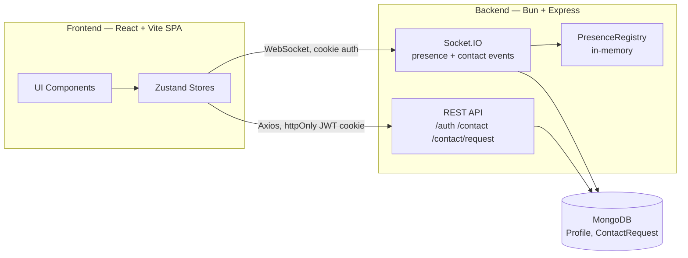

# Blackjack for Friends

Multiplayer blackjack played in real-time. Players add contacts, send invites, and join game lobbies.

## Status

| Area                  | State                                                                 |
| ---------------------- | ---------------------------------------------------------------------- |
| Auth                    | ✅ Done — signup, signin, signout, auth-check; JWT in an httpOnly cookie |
| Contacts & real-time    | ✅ Done — requests, presence, and live sync over Socket.IO, end-to-end |
| Frontend pages          | 🚧 In progress — contacts UI is live; most other pages are skeletons  |
| Game                    | ⬜ Not started                                                          |

## Architecture



REST handles auth and request/response actions; Socket.IO carries everything that needs to push to the client — presence changes and contact events land on both parties' devices without a refresh.

## Tech Stack

### Shared

- **Bun** — TypeScript runs directly, no build step
- **TypeScript**
- **Zod v4**

### Backend

- **Express 5**
- **MongoDB + Mongoose**
- **Socket.IO 4** with **`@socket.io/bun-engine`** — Bun-native transport rather than the Node default
- **JWT** (`jsonwebtoken`) — stateless auth, no session store
- **`nanoid`** — generates the app's canonical 20-digit numeric user ID, used in place of Mongo `_id`s

### Frontend

- **React 19 + Vite 8**
- **Tailwind CSS 4 + DaisyUI 5**
- **TanStack Router v1** — file-based routing
- **Zustand v5**
- **`socket.io-client`**

## Project Structure

```
blackjack-for-friends/
├── backend/    # Bun + Express API + Socket.IO server
└── frontend/   # React + Vite SPA
```

## Getting Started

1. Copy `backend/.env.example` to `backend/.env` and fill in real values (a MongoDB URI, a JWT secret, etc).
2. From the repo root:

   ```bash
   bun run dev
   ```

   Runs the backend and frontend together in watch mode. Requires a real MongoDB connection in `backend/.env`.

   Or, to try the app with no database setup:

   ```bash
   bun run tester
   ```

   Boots the backend against a disposable in-memory MongoDB replica set, pre-seeded with 5 demo accounts (`testuser1@example.com` … `testuser5@example.com`, password `1234567890123456`) — sign in immediately, no real database required. This is a local demo convenience, not an automated test suite.

Each package can also be run on its own:

```bash
cd backend && bun run dev
cd frontend && bun run dev
```

## Roadmap

- Real-time chat
- Presence resync on reconnect
- Game engine and rules
- Lobbies and invites
- Containerize and deploy (AWS or DigitalOcean)
