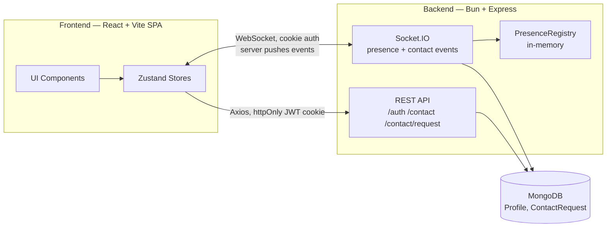
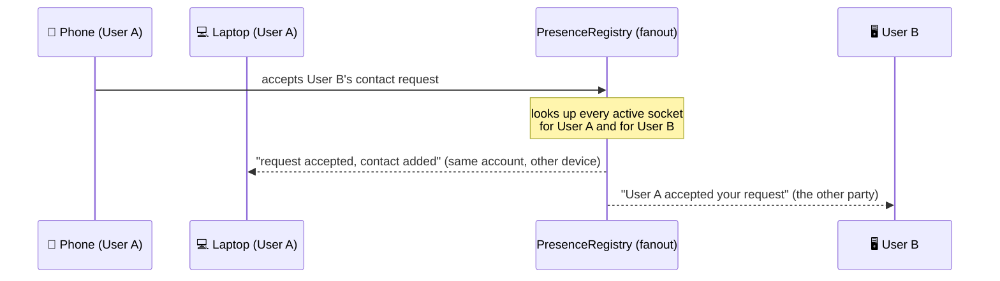

# Blackjack for Friends

Multiplayer blackjack played in real-time. Today, players can add each other as contacts and see who's online; game lobbies and invites come next.

**What's here today is functional** — auth and contacts/presence run end-to-end. Clone the repo and try it yourself: `bun run demo` boots a local demo in seconds, no database setup required (see [Demo](#demo)).

## Features

- Sign up, sign in, sign out — sessions persist across visits
- Add contacts by user ID; sending, accepting, rejecting, and cancelling requests all sync in real time
- See which of your contacts are online, live
- Every real-time update reaches every device you're signed into, including your own

## Status

| Area | State |
| --- | --- |
| Auth | ✅ Functional — signup, signin, signout, auth-check; signout doesn't revoke the token yet |
| Contacts & real-time | ✅ Functional — requests, presence, and live sync over Socket.IO, end-to-end; known presence race when one user's sockets connect simultaneously |
| Frontend pages | 🚧 In progress — contacts UI is live; other pages are functional skeletons (routed and working, just minimal) |
| Game | ⬜ Not started |

## Architecture


```mermaid
flowchart LR
    subgraph Client["Frontend — React + Vite SPA"]
        UI[UI Components]
        Store[Zustand Stores]
    end

    subgraph Server["Backend — Bun + Express"]
        REST["REST API<br/>/auth /contact /contact/request"]
        IO["Socket.IO<br/>presence + contact events"]
        Reg["PresenceRegistry<br/>in-memory"]
    end

    DB[(MongoDB<br/>Profile, ContactRequest)]

    UI --> Store
    Store -- "Axios, httpOnly JWT cookie" --> REST
    Store <-- "WebSocket, cookie auth<br/>server pushes events" --> IO
    REST --> DB
    IO --> Reg
    IO --> DB
```

REST handles request/response actions (auth, contacts); Socket.IO pushes updates to the client as they happen.

### Patterns in Use

- Layered architecture — controller → service → model, each with one job
- Service layer split by data model rather than by feature
- Transactional writes — multi-document updates (e.g. accepting a request) succeed or fail as one unit
- Server-push fanout — a single event reaches everyone it concerns
- In-memory registry — presence tracked in process memory, not the database
- Centralized, store-based state management (Zustand)
- File-based, convention-driven routing

### Real-Time Fanout

`PresenceRegistry` keeps state synced across every device, for every user an update concerns — including whoever triggered it:


```mermaid
sequenceDiagram
    participant Phone as 📱 Phone (User A)
    participant Laptop as 💻 Laptop (User A)
    participant Reg as PresenceRegistry (fanout)
    participant Friend as 🖥️ User B

    Phone->>Reg: accepts User B's contact request
    Note over Reg: looks up every active socket<br/>for User A and for User B
    Reg-->>Laptop: "request accepted, contact added" (same account, other device)
    Reg-->>Friend: "User A accepted your request" (the other party)
```

Presence fans out differently: when a user's first device connects or their last one disconnects, the update goes only to their contacts, not to the user's own other devices.

## Tech Stack

### Shared

- **Bun** — TypeScript runs directly
- **TypeScript**
- **Zod v4**

### Backend

- **Express 5**
- **MongoDB + Mongoose**
- **Socket.IO 4** with **`@socket.io/bun-engine`** — Bun-native transport rather than the Node default
- **JWT** (`jsonwebtoken`) — stateless auth, no session store
- **`nanoid`** — generates the app's canonical 20-digit numeric user ID, used in place of Mongo `_id`s

### Frontend

- **React 19 + Vite 8**
- **Tailwind CSS 4 + DaisyUI 5**
- **TanStack Router v1** — file-based routing
- **Zustand v5**
- **`socket.io-client`**

## Project Structure

```
blackjack-for-friends/
├── backend/    # Bun + Express API + Socket.IO server
└── frontend/   # React + Vite SPA
```

## Getting Started

Install everything from the repo root:

```bash
bun run install:all
```

There are separate start scripts for development and demo.

### Development

Requires a `backend/.env` file with real values (a MongoDB URI, a JWT secret, etc).

```bash
bun run dev
```

Runs the backend and frontend together in watch mode.

Each package can also be run on its own:

```bash
cd backend && bun run dev
cd frontend && bun run dev
```

### Demo

Copy `backend/.env.example` to `backend/.env` — the example values work as-is.

```bash
bun run demo
```

Boots the backend against a disposable in-memory MongoDB replica set, pre-seeded with 5 demo accounts (`testuser1@example.com` … `testuser5@example.com`, password `1234567890123456`) — sign in immediately, no real database required.

## Roadmap

Contacts and presence already answer "who's available to play" — the next phase builds lobbies and gameplay on top of that:

- Integration tests
- Migrate backend from Express to Hono
- Rate limiter
- Direct messaging between contacts, plus in-lobby chat during a game
- Debounce presence disconnects — smoother than today's full rebuild on reconnect
- Game engine and rules
- Create/join game lobbies, invite contacts to a table
- Containerize and deploy (AWS or DigitalOcean)
